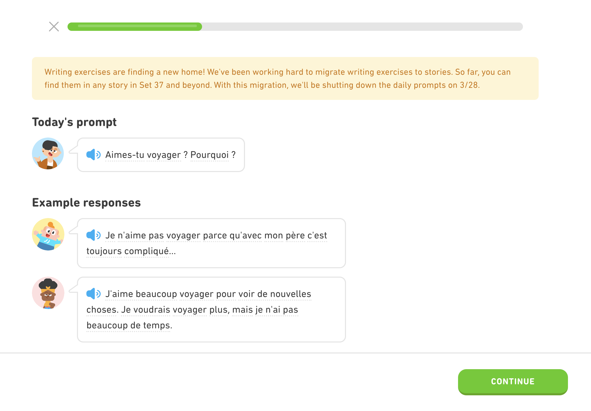

# Duolingo Hoots Archive

A home for my submitted answers.

## 😢 Goodbye


> https://hoots.duolingo.com
> Writing exercises are finding a new home! We've been working hard to migrate writing exercises to stories. So far, you can find them in any story in Set 37 and beyond. With this migration, we'll be shutting down the daily prompts on 3/28.

### What is Hoots?
Duolingo Hoots is a daily writing exercise where you are given a prompt and some example sentences, and then you have to write your own response. It's like journaling prompt in your target language. 

For some time, I would only write here and read other learners' submissions instead of doing actual lessons. It helped a lot more to think and write in the language. When I found out Hoots is going away after forum, I needed to save all my progress...


## 🚀 Built With
- React
- styled-components

## 👩🏻‍💻 Running Locally

```
npm install
npm start
```
The app will be running at [http://localhost:3000](http://localhost:3000)

### Root relative path & Github Pages

To deploy with `gh-pages`, a "homepage" is added in package.json which causes a change in root path with your repo name (https://{username}.github.io/{repo}). To handle this:

1. Add `basename` to Router (See [Building for Relative Paths](https://create-react-app.dev/docs/deployment/#building-for-relative-paths))

2. Update assets path

- Import without absolute path
```js
// ❌ Absolute path starting at root
// https://username.github.io/images/file.jpg
src={`/images/file.jpg`}

// ✅ Relative path
// https://username.github.io/repo/images/file.jpg
src={`images/file.jpg`}
```

- Update `PUBLIC_URL` to match repo

`PUBLIC_URL` is used to reference your public folder. When run locally, `public` folder will point to http://localhost:3000/{repo} as a result of "homepage". Fix public asset links by:

Setting variable in script
```sh
PUBLIC_URL=/ npm run start
```

Or, creating a `.env` file
```
PUBLIC_URL=/
```

## 📝 Data Source

[Prompts data](src/data/prompts.json) were extracted from Hoots API i.e.

```
https://hoots.duolingo.com/userApi/prompts?todayDate=2022-03-28&learningLanguage=fr&fromLanguage=en
https://hoots.duolingo.com/userApi/v1/prompt?learningLanguage=fr&fromLanguage=en&promptDate=2022-03-28&todayDate=2022-03-28&generateMissingTranslationHints=false
https://hoots.duolingo.com/userApi/translate
```


## Reference & Credit

All assets are by Duolingo.
- [Duolingo Brand Guidlelines](https://design.duolingo.com/)
- [Color](https://design.duolingo.com/identity/color#core-brand-colors)

## Todo Ideas

- [x] Audio
- [x] Status filter
- [ ] SVG animation
- [ ] Hover tooltip
